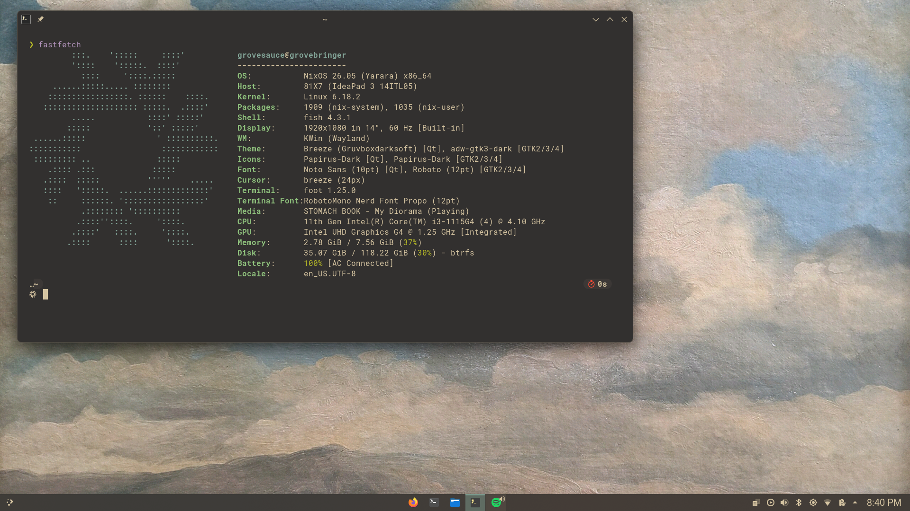

<<<<<<< HEAD
# my complex heaven...

<div align="center">

</div>
=======
# flake

> [!WARNING]
> use or fork at your own risk.
>>>>>>> 1db2280 (Refactor)

> *"You'll get there ! Running NixOS is a lot of fun, feels like there's always something to improve about your config."*  
> — **Elythh**

<<<<<<< HEAD

## ... Hosts

| Host | Type |
|------|------|
| `cherries` | Laptop |
| `aureliteiron` | Desktop |

## ... Installation 

0. Make sure nix-commands flakes and pipe-operators are enabled
1. Clone the repository
2. Edit `flake.nix` and change the username
3. For hardware configuration:
   - Delete `hardware.nix` to use `/etc/nixos/hardware-configuration.nix`
   - Or modify the existing file
   - May need `--impure` flag for detection

## ... TODO

- [x] Switch to window manager on `cherries`
- [x] Implement sops-nix for secrets management

## ... Credits

- [kewin-y](https://github.com/kewin-y) - LabWC configuration
- [elythh](https://github.com/elythh) - Structural inspiration and the main motivator 
- [astrid](https://github.com/eepy-goddess/astrid-flake) - River configuration
- [alexpkgs](https://github.com/alexpkgs) - Previous configuration
- [linuxmobile](https://github.com/linuxmobile) - Configuration references

---
**Boston, Massachusetts**
=======
## Doc

Flake written in cherry-dialect (my strict-clean Nix style).

## Install

### Requirements

Enable flakes and pipe-operators:

```nix
nix = {
  settings = {
    experimental-features = [
      "nix-command"
      "flakes"
      "pipe-operators"
    ];
  };
};
```

just shell git (my prefered method):

```bash
nix-shell -p git
```

### Setup

1. Clone the repository:

```bash
git clone https://github.com/qfumbled/grovebringer.git
cd grovebringer
```

2. Edit configuration:
   - `flake.nix`: set your username on line 81
   - `hardware.nix`: edit for your hardware, or remove it and use `--impure` flag since is outside of the repo directory

### Build

1. Build the system:

```bash
sudo nixos-rebuild switch --flake .#<hostname>
```

2. If you removed `hardware.nix`, add `--impure`:

```bash
sudo nixos-rebuild switch --flake .#<hostname> --impure
```

## Usage

Rebuild after changes:

```bash
sudo nixos-rebuild switch --flake .#<hostname>
```

Test without switching:

```bash
sudo nixos-rebuild test --flake .#<hostname>
```

## WIP

- [x] cherries using wm
- [ ] rename aureliteiron to chimera sounds cool !
- [x] 75% of the configuration should be using cherry-dialect

## Screenshots

### cherries (laptop)



### chimera (desktop)


## Credits

- [elythh](https://github.com/elythh) - Structural inspiration and the main motivator
- [astrid](https://github.com/eepy-goddess/astrid-flake) - 6% of the configuration
- [alexpkgs](https://github.com/alexpkgs) - Previous configuration
- [linuxmobile](https://github.com/linuxmobile) - Configuration references
>>>>>>> 1db2280 (Refactor)
