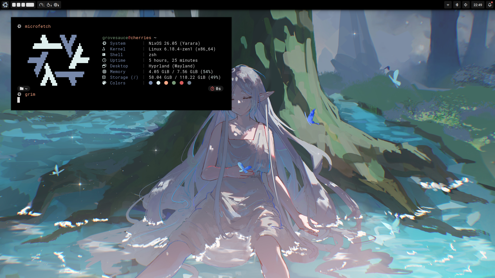

# Mit hjem

> [!WARNING]
> use or fork at your own risk.

> *"You'll get there ! Running NixOS is a lot of fun, feels like there's always something to improve about your config."*  
> — **Elythh**

## Doc

Flake written in cherry-dialect (my strict-clean Nix style).

## Install

### Requirements

Enable flakes and pipe-operators:
```nix
nix = {
  settings = {
    experimental-features = [
      "nix-command"
      "flakes"
      "pipe-operators"
    ];
  };
};
```

just shell git (my prefered method):
```bash
nix-shell -p git
```

### Setup

1. Clone the repository:
```bash
git clone https://github.com/qfumbled/grovebringer.git
cd grovebringer
```

2. Edit configuration:
   - `flake.nix`: set your username on line 81
   - `hardware.nix`: edit for your hardware, or remove it and use `--impure` flag since is outside of the repo directory

3. Edit locale:
   - `grovebringer/modules/nixos/core/locale/default.nix`: set your timezone on line 3

### Build

1. Build the system:
```bash
sudo nixos-rebuild switch --flake .#<hostname>
```

2. If you removed `hardware.nix`, add `--impure`:
```bash
sudo nixos-rebuild switch --flake .#<hostname> --impure
```

## Usage

Rebuild after changes:
```bash
sudo nixos-rebuild switch --flake .#<hostname>
```

Test without switching:
```bash
sudo nixos-rebuild test --flake .#<hostname>
```

## WIP

- [] seperate stylix themes for each host (laptop, solarized  desktop,vivi)
- [x] cherry-dialect consiste
- [] host first configuration 
- [] use hjem (not fully but 15%)
- [] delete hyprland, foot, vicinae for good.
- [] discord or oxicord?

## Screenshots

### jemflake (laptop)



### chimera (desktop)


## Credits

- [elythh](https://github.com/elythh) - Structural inspiration and the main motivator
- [linuxmobile](https://github.com/linuxmobile) - Configuration references
- [poacher](https://codeberg.org/poacher) - wrappers, etc
